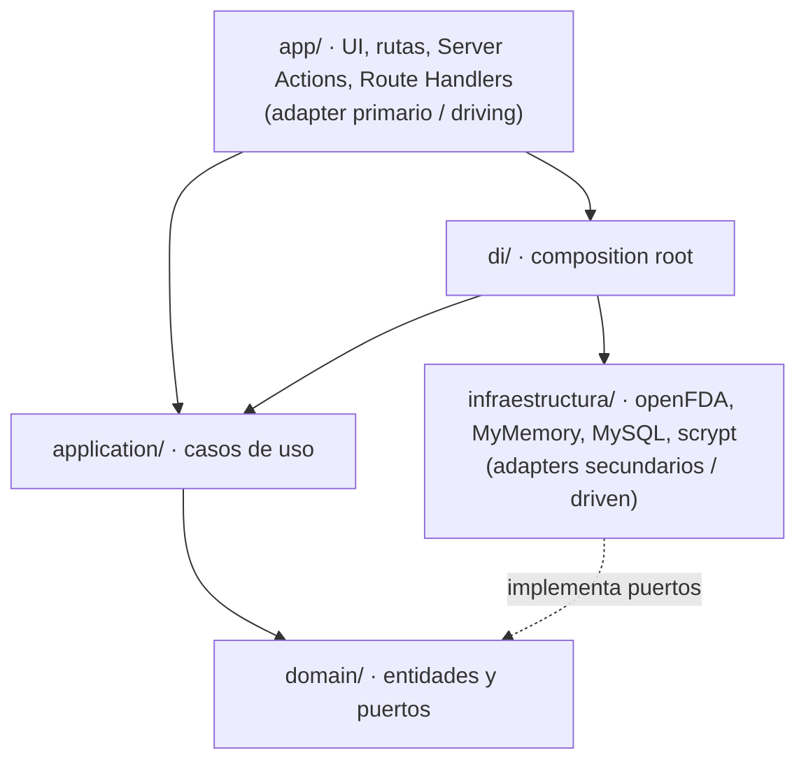
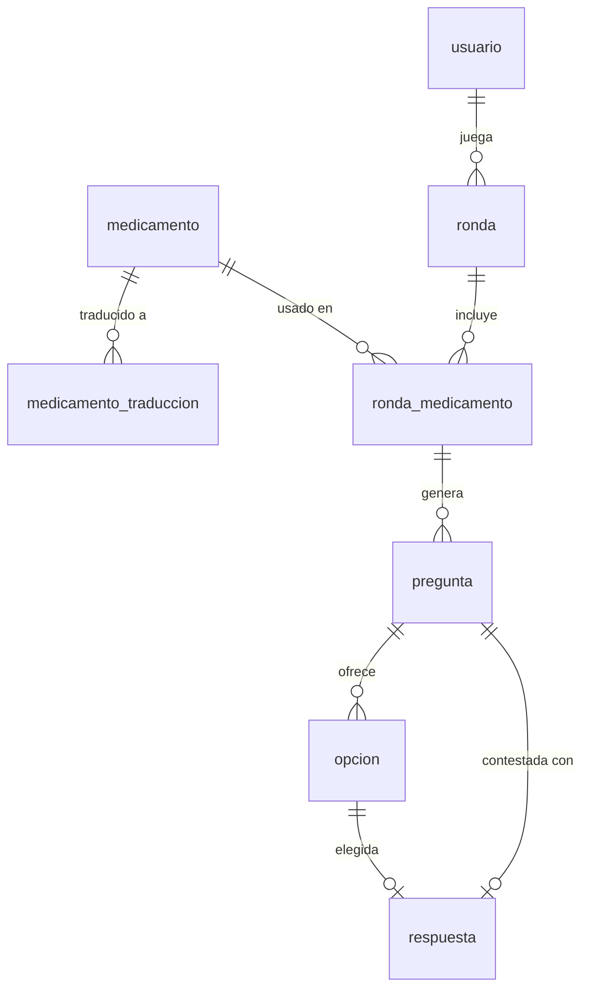

# FarmaceuticoLearn


**Plataforma de estudio de medicamentos para estudiantes de farmacia.** El usuario consulta y repasa fichas de fármacos (principio activo, indicaciones, dosis, contraindicaciones, efectos adversos) construidas a partir de APIs públicas, y practica con **rondas de repaso tipo test**.

El proyecto **no es la fuente de la verdad** de los datos: los consume de fuentes externas (openFDA, PubChem), los traduce a su propio modelo de dominio y los presenta en un formato pensado para aprender. La base de datos MySQL funciona como **caché local**, no como origen primario.

> La marca visible en la interfaz es *FarmaEdu*; la base de datos se llama `farmaciaLear`. Son el mismo proyecto en distintas capas.

---

## Índice

- [1. Avances y funcionalidades](#1-avances-y-funcionalidades)
- [2. Stack y entorno](#2-stack-y-entorno)
- [3. Arquitectura: hexagonal + DDD](#3-arquitectura-hexagonal--ddd)
- [4. Estructura de carpetas](#4-estructura-de-carpetas)
- [5. Modelo de datos (MySQL)](#5-modelo-de-datos-mysql)
- [6. Sistema de diseño](#6-sistema-de-diseño)
- [7. Flujo de datos y proceso](#7-flujo-de-datos-y-proceso)
- [8. Fuentes de datos externas](#8-fuentes-de-datos-externas)
- [9. Claves de uso: correr en local](#9-claves-de-uso-correr-en-local)
- [10. Variables de entorno](#10-variables-de-entorno)
- [11. Scripts disponibles](#11-scripts-disponibles)
- [12. Rutas y páginas](#12-rutas-y-páginas)
- [13. API de usuarios (REST)](#13-api-de-usuarios-rest)
- [14. Decisiones y pendientes](#14-decisiones-y-pendientes)
- [15. Cómo se construyó (colaboración con IA)](#15-cómo-se-construyó-colaboración-con-ia)

---

## 1. Avances y funcionalidades

| Módulo | Estado | Descripción |
|---|---|---|
| **Catálogo y fichas** | Funcional | Enciclopedia de medicamentos con buscador y filtro por categoría terapéutica. Ficha por fármaco con sus secciones de prospecto. |
| **Traducción diferida** | Funcional | openFDA entrega el contenido en inglés; se traduce al español bajo demanda (adapter MyMemory) y se **cachea** en la base. Solo se traduce una vez por campo. |
| **Imágenes moleculares** | Funcional | Cada card muestra la estructura molecular del principio activo (PubChem, dominio público), no una foto del producto (por copyright). Se descargan una vez a `public/estructuras/`. |
| **Juego de repaso** | Funcional | Rondas tipo test **en español**: se nombra un fármaco y se pregunta por su **grupo terapéutico** o su **principio activo**, con 4 opciones, temporizador, barra de progreso y puntuación. |
| **Ranking** | Funcional | Leaderboard calculado con la vista SQL `v_ranking` a partir de las rondas terminadas. |
| **Usuarios (registro + login)** | Funcional | Alta de cuenta e inicio de sesión con contraseñas hasheadas (scrypt). *La sesión persistente está pendiente; ver `TODO(auth)`.* |

**Sobre el juego:** las preguntas se montan únicamente sobre datos estructurados y en español —el **grupo terapéutico** (deducido del principio activo) y el propio **principio activo**—. No se muestran fragmentos crudos del prospecto, porque openFDA solo los ofrece como prosa libre en inglés, difícil de convertir en opciones claras.

---

## 2. Stack y entorno

| Pieza | Versión | Rol |
|---|---|---|
| **Lenguaje** | TypeScript 5 | Todo el código, front y back. |
| **Framework** | Next.js 16.2 (App Router) | UI, rutas, Server Actions y Route Handlers. |
| **UI** | React 19.2 | Componentes de servidor y de cliente. |
| **Estilos** | Tailwind CSS 4 | Diseño con tokens de color propios definidos en `globals.css`. |
| **Base de datos** | MySQL 8+ / MariaDB (driver `mysql2`) | Caché de fichas, traducciones, usuarios y rondas. |
| **Runtime / tooling** | Node.js 20.6+ (probado en 24), `tsx`, ESLint 9 | Ejecutar scripts `.mts`/`.mjs` y lint. |
| **Hashing** | `node:crypto` (scrypt) | Sin dependencias externas de criptografía. |

> Esta versión de Next.js trae *breaking changes* respecto a lo que "se sabe" de Next. Antes de escribir código, consulta la guía correspondiente en `node_modules/next/dist/docs/`. Ver [`AGENTS.md`](./AGENTS.md).

---

## 3. Arquitectura: hexagonal + DDD

La decisión de fondo del proyecto: **el dominio no sabe que existe Next.js, ni HTTP, ni openFDA, ni MyMemory, ni MySQL.** Todo lo de fuera entra y sale por **puertos** (interfaces que define el dominio) implementados con **adapters** en infraestructura.

El motivo práctico: si mañana se cambia openFDA por CIMA/AEMPS, MyMemory por DeepL, o el hashing de scrypt por bcrypt, se escribe un adapter nuevo y **no se toca ni una línea** del dominio ni de la aplicación.

### La regla de dependencia

Las dependencias apuntan **siempre hacia adentro**, nunca al revés.



- `domain/` no importa de nadie.
- `application/` solo importa de `domain/` (orquesta casos de uso).
- `infraestructura/` implementa los puertos de `domain/` (habla con el mundo real).
- `app/` invoca casos de uso ya cableados en `di/`; **nunca** llama a un servicio externo directamente.
- `di/container.ts` es el **composition root**: la única capa que sabe a la vez qué puertos existen y qué adapters los cumplen.

### Bounded contexts (DDD)

El código se divide en tres contextos independientes, cada uno con su propio dominio. El contexto `juego` **no importa** del contexto `medicamentos`: define su propia vista (`MedicamentoJugable`) para no acoplarse.

| Contexto | Responsabilidad |
|---|---|
| `medicamentos` | Catálogo, fichas, sincronización desde openFDA y traducción. |
| `juego` | Rondas de repaso: generación de preguntas, puntuación y ranking. |
| `usuarios` | Registro, login y hashing de contraseñas. |

---

## 4. Estructura de carpetas

```
src/
├── medicamentos/                 # contexto: catálogo, fichas y traducción
│   ├── domain/                   Medicamento, Ficha, FichaMedicamento,
│   │                             CatalogoExterno (puerto), MedicamentoRepository (puerto),
│   │                             TraduccionRepository (puerto), Traductor (puerto)
│   ├── application/              BuscarMedicamentos, ObtenerFichaMedicamento,
│   │                             SincronizarMedicamentos
│   └── infraestructura/          OpenFdaCatalogo, MyMemoryTraductor, GoogleTraductor,
│                                 MysqlMedicamentoRepository, MysqlTraduccionRepository
│
├── juego/                        # contexto: rondas de repaso tipo test
│   ├── domain/                   MedicamentoJugable, Ronda, Pregunta, Opcion,
│   │                             GeneradorDePreguntas, Ranking,
│   │                             CatalogoJugable (puerto), RondaRepository (puerto)
│   ├── application/              CrearRonda, ObtenerRonda, ResponderPregunta, ObtenerRanking
│   └── infraestructura/          MysqlCatalogoJugable, MysqlRondaRepository, MysqlRanking
│
├── usuarios/                     # contexto: registro, login y hashing
│   ├── domain/                   Usuario, Hasher (puerto), UsuarioRepository (puerto), errors
│   ├── application/              CrearUsuario, IniciarSesion, validacion
│   └── infraestructura/          MysqlUsuarioRepository, ScryptHasher
│
├── shared/                       # transversal: pool de MySQL, contenido compartido
├── di/                           # composition root (container.ts)
└── app/                          # App Router (adapter primario)
    ├── page.tsx                  inicio
    ├── layout.tsx / Nav.tsx      layout global y barra de navegación
    ├── globals.css               sistema de diseño (tokens)
    ├── medicamentos/             enciclopedia y ficha [id]
    ├── juego/                    crear ronda (nueva) y jugarla [id]
    ├── ranking/                  leaderboard
    ├── usuarios/                 crear cuenta / iniciar sesión
    └── api/usuarios/             Route Handlers REST

public/estructuras/               imágenes moleculares (PNG, PubChem)
scripts/                          sync, seed, descarga de estructuras, check-db
schema.sql                        esquema completo de la base
```

---

## 5. Modelo de datos (MySQL)

Base `farmaciaLear` (`utf8mb4` / `utf8mb4_unicode_ci`, InnoDB). El esquema completo está en [`schema.sql`](./schema.sql). Se agrupa en tres bloques: **caché de datos** (medicamento + traducción), **juego** (usuario, ronda y todo lo que cuelga de ella) y **leaderboard** (una vista).

### Diagrama entidad-relación



### Tablas

**`medicamento`** — caché local de una ficha de openFDA.
- Columnas extraídas para consultar rápido (`nombre_marca`, `nombre_generico`, `principio_activo`, `fabricante`) y los cinco textos del prospecto en `MEDIUMTEXT` (`indicaciones`, `contraindicaciones`, `dosis`, `efectos_adversos`, `advertencias`).
- `payload_json` guarda la respuesta cruda de openFDA por si hace falta re-extraer campos sin volver a llamar a la API.
- `UNIQUE (openfda_set_id)` permite hacer *upsert*: re-sincronizar no duplica filas. Índices por nombre de marca y genérico para el buscador.

**`medicamento_traduccion`** — caché de traducciones al español.
- `UNIQUE (medicamento_id, idioma, campo)`: una traducción por campo e idioma; nunca se paga dos veces por lo mismo.
- `campo` es un `ENUM` de las cinco secciones. `ON DELETE CASCADE`: borrar el medicamento se lleva sus traducciones.

**`usuario`** — cuentas.
- `UNIQUE (correo)` evita registros duplicados (la API devuelve `409` en ese caso). La contraseña se guarda en `password_hash` (formato `salt:hash`, scrypt); nunca en claro.

**`ronda`** — una partida de repaso.
- `estado ENUM('en_curso','terminada','abandonada')` y `tipo_juego ENUM('opcion_multiple')` (dejado abierto para futuros modos).
- `puntos` se **congela** al cerrar la ronda: es un hecho histórico, no se recalcula (si mañana cambia la fórmula, las partidas viejas conservan lo que el usuario ganó).
- `ON DELETE CASCADE` desde `usuario`: borrar un usuario borra sus rondas.

**`ronda_medicamento`** — los fármacos que el usuario eligió para la ronda (relación N:M).
- Clave primaria compuesta `(ronda_id, medicamento_id)`.
- FK a `medicamento` con `ON DELETE RESTRICT`: **no se puede borrar un medicamento que forma parte de una ronda**, para no dejar preguntas huérfanas.

**`pregunta`** — cada pregunta de la ronda.
- `atributo ENUM('grupo_terapeutico','principio_activo')`: el **tipo** de pregunta (la columna conserva el nombre histórico). `enunciado` es el texto ya en español.
- `UNIQUE (ronda_id, orden)`: sin huecos ni repetidos en el orden.
- **FK compuesta** `(ronda_id, medicamento_id)` → `ronda_medicamento`: garantiza a nivel de base que una pregunta solo puede tratar sobre un medicamento que el usuario efectivamente eligió.

**`opcion`** — las respuestas posibles de cada pregunta.
- `UNIQUE (pregunta_id, orden)` ordena las opciones (A/B/C/D).
- `correcta_unica` es una **columna generada** (`GENERATED ALWAYS AS (IF(es_correcta, pregunta_id, NULL)) STORED`) con `UNIQUE`: como el índice único ignora los `NULL`, esto fuerza **como máximo una opción correcta por pregunta** sin necesidad de un trigger.
- `UNIQUE (id, pregunta_id)` existe para que `respuesta` pueda apuntar con una FK compuesta.

**`respuesta`** — la opción que eligió el usuario.
- `UNIQUE (pregunta_id)`: una sola respuesta por pregunta (un `INSERT IGNORE` hace que un doble clic o un F5 no exploten).
- **FK compuesta** `(opcion_id, pregunta_id)` → `opcion`: la opción elegida debe pertenecer a esa misma pregunta; no se puede responder con una opción de otra pregunta.
- `tiempo_ms` guarda lo que tardó en contestar (para métricas futuras).

### Vista `v_ranking`

Leaderboard calculado, no una tabla: suma los `puntos` de las rondas **terminadas** por usuario, cuenta partidas y guarda la fecha de la última.

```sql
SELECT u.id, u.nombre,
       COALESCE(SUM(r.puntos), 0) AS puntos_totales,
       COUNT(r.id)                AS rondas_jugadas,
       MAX(r.terminada_en)        AS ultima_partida
FROM usuario u
LEFT JOIN ronda r ON r.usuario_id = u.id AND r.estado = 'terminada'
GROUP BY u.id, u.nombre
ORDER BY puntos_totales DESC;
```

> **Integridad delegada a la base:** el patrón de todo el bloque de juego es dejar que las claves compuestas y los índices únicos hagan cumplir las reglas (una correcta por pregunta, una respuesta por pregunta, preguntas solo sobre medicamentos elegidos), en vez de confiar únicamente en el código de aplicación.

---

## 6. Sistema de diseño

Definido en [`src/app/globals.css`](./src/app/globals.css) sobre Tailwind CSS 4. Todo color, radio y sombra sale de **tokens** centralizados: ninguna pantalla inventa valores sueltos (así una interfaz no acaba con siete azules distintos).

- **Tema claro fijo:** a propósito **no** se sigue el `prefers-color-scheme` del sistema, para que los colores coincidan siempre con el mockup.
- **Identidad:** clínica y confiable, con acento azul marino y verde.
- **Números tabulares:** la clase `.tabular` (`font-variant-numeric: tabular-nums`) alinea puntos, temporizador y niveles.
- **Radio de tarjeta** (`--radius-tarjeta`) y dos sombras (`--shadow-suave`, `--shadow-elevada`) unifican la elevación.

| Token | Valor | Uso |
|---|---|---|
| `--canvas` | `#eef2fb` | Fondo de página (azul lavanda muy claro). |
| `--surface` | `#ffffff` | Tarjetas. |
| `--marca` | `#1e3a8a` | Azul marino: botones primarios, marca. |
| `--marca-brillante` | `#2563eb` | Azul vivo: enlaces, estado activo, selección. |
| `--exito` | `#0e9f6e` | Verde: acciones positivas, XP. |
| `--error` | `#dc2626` | Errores. |
| `--oro` | `#f4b740` | Medallas. |
| `--ink` / `--ink-suave` / `--ink-tenue` | `#0f1b34` … | Jerarquía de texto (principal, secundario, metadatos). |

Los iconos son **SVG inline** (sin librería de iconos), y la barra de navegación (`Nav.tsx`) es responsiva: horizontal centrada en escritorio, con una fila desplazable en móvil.

---

## 7. Flujo de datos y proceso

1. **Ingesta.** El caso de uso `SincronizarMedicamentos` pide fichas a openFDA (adapter `OpenFdaCatalogo`) y las guarda en `medicamento` (con `payload_json` crudo incluido). Es una caché: no se llama a la API en cada carga de página.
2. **Traducción diferida.** Al abrir una ficha, `ObtenerFichaMedicamento` recorta el texto a lo esencial, mira qué campos ya están en `medicamento_traduccion` y solo traduce los que faltan (adapter `MyMemoryTraductor`), guardando el resultado. Si el traductor falla (cuota, red, key), **la ficha se sigue viendo** en inglés en vez de romper la página.
3. **Presentación.** Las páginas del App Router invocan casos de uso ya cableados en `di/container.ts` y muestran el modelo propio, nunca la respuesta cruda de la API.
4. **Repaso.** El juego lee del catálogo (`MysqlCatalogoJugable`), genera preguntas tipadas (`GeneradorDePreguntas`) sobre datos estructurados y persiste la ronda dentro de una transacción; al terminar calcula puntos y alimenta `v_ranking`.

---

## 8. Fuentes de datos externas

| Servicio | Rol | ¿Necesita credencial? |
|---|---|---|
| [openFDA](https://open.fda.gov/apis/) | Fuente de las fichas (drug label). Devuelve todo **en inglés**. | API key **opcional** (sube el rate limit). |
| [MyMemory](https://mymemory.translated.net/doc/spec.php) | Traduce el contenido de la ficha al español. **Adapter en uso.** | **No.** Solo un email opcional para ampliar cuota. |
| [PubChem](https://pubchem.ncbi.nlm.nih.gov/) | Estructuras moleculares de los principios activos (dominio público). | No. |
| [Google Cloud Translation](https://cloud.google.com/translate/docs) | Traductor alternativo (adapter escrito, no cableado). | API key (si se decide usar). |

---

## 9. Claves de uso: correr en local

> Esta guía está pensada para **no fallar**: comandos exactos, verificaciones en cada paso y una tabla de errores comunes al final. Sigue los pasos **en orden**. Los bloques traen la variante para **PowerShell (Windows)** y para **Bash (Git Bash / macOS / Linux)** cuando difieren.

### 9.1. Requisitos previos (verifícalos antes de empezar)

| Requisito | Versión mínima | Cómo comprobarlo | Dónde conseguirlo |
|---|---|---|---|
| **Node.js** | 20.6+ (probado en 24) | `node -v` | [nodejs.org](https://nodejs.org) (LTS) |
| **npm** | viene con Node | `npm -v` | (incluido con Node) |
| **Git** | cualquiera reciente | `git --version` | [git-scm.com](https://git-scm.com) |
| **MySQL / MariaDB** | MySQL 8+ | `mysql --version` | [XAMPP](https://www.apachefriends.org) es lo más simple en Windows |

> **Node < 20.6 = fallo seguro.** El proyecto usa `node --env-file=...`, que **no existe** antes de 20.6. Si `node -v` muestra 18.x o 20.5, actualiza antes de continuar.

Si usas **XAMPP**, abre el *Control Panel* y pulsa **Start** en el módulo **MySQL** antes del paso 9.4. Debe quedar en verde.

### 9.2. Clonar el repositorio e instalar dependencias

```bash
git clone https://github.com/leo12L/FarmaceuticoLearn.git
cd FarmaceuticoLearn
npm install
```

> La carpeta que crea `git clone` se llama **`FarmaceuticoLearn`** (el nombre del repo), no `page_medicamento`. Todos los comandos siguientes se ejecutan **dentro** de esa carpeta.

### 9.3. Crear la base de datos y las tablas

El `schema.sql` **borra y recrea** la base `farmaciaLear` con todas sus tablas y la vista `v_ranking`.

**Opción A — con `mysql` en el PATH** (si `mysql --version` funcionó):

```bash
mysql -u root -p < schema.sql
```

**Opción B — XAMPP en Windows sin `mysql` en el PATH** (PowerShell). El binario vive dentro de XAMPP; ejecútalo por ruta completa:

```powershell
& "C:\xampp\mysql\bin\mysql.exe" -u root -p < schema.sql
```

> Con XAMPP recién instalado, el usuario `root` **no tiene contraseña**: cuando pida el password, pulsa **Enter** en vacío.

### 9.4. Configurar las variables de entorno

Copia la plantilla a `.env.local` (este archivo **no** se commitea; está en `.gitignore`):

```powershell
# PowerShell (Windows)
Copy-Item .env.example .env.local
```

```bash
# Bash (Git Bash / macOS / Linux)
cp .env.example .env.local
```

Abre `.env.local` y ajusta tus credenciales de MySQL (detalle en la [sección 10](#10-variables-de-entorno)).

> ⚠️ **El fallo más común está aquí.** El `schema.sql` crea la base **`farmaciaLear`** (sin la "n" final), pero la plantilla trae `MYSQL_DATABASE=farmaciaLearn`. **Corrige esa línea** para que coincida **exactamente** con la base creada:
>
> ```env
> MYSQL_DATABASE=farmaciaLear
> ```
>
> Con XAMPP, deja `MYSQL_USER=root` y `MYSQL_PASSWORD=` **vacío**.

### 9.5. Verificar la conexión (antes de arrancar nada)

```bash
node --env-file=.env.local scripts/check-db.mjs
```

Si imprime que la conexión y las tablas están OK, puedes seguir. Si falla, **no continúes**: revisa la [tabla de errores](#97-errores-comunes-y-solución) — casi siempre es MySQL apagado o el nombre de la base mal escrito.

### 9.6. Poblar el catálogo y arrancar

```bash
# 1. Poblar el catálogo desde openFDA (selección variada de fármacos comunes)
node --conditions=react-server --import tsx --env-file=.env.local scripts/seed-catalogo.mts

# 2. (Opcional) Descargar las estructuras moleculares a public/estructuras/
node --env-file=.env.local scripts/descargar-estructuras.mjs

# 3. Arrancar en desarrollo
npm run dev        # -> http://localhost:3000
```

Abre **http://localhost:3000** en el navegador. Si ves la enciclopedia con fichas, todo está funcionando.

> **La única credencial obligatoria es la de MySQL.** openFDA y MyMemory funcionan sin clave (la API key / el email solo amplían la cuota diaria), y Google solo hace falta si cambias el traductor en `src/di/container.ts`.

Para traer un fármaco concreto en cualquier momento:

```bash
npm run sync -- ibuprofen          # un término
npm run sync -- "amoxicillin" 50   # término + límite de resultados
```

### 9.7. Errores comunes y solución

| Síntoma | Causa | Solución |
|---|---|---|
| `bad option: --env-file` | Node < 20.6 | Actualiza Node a 20.6+ (`node -v`). |
| `ECONNREFUSED 127.0.0.1:3306` | MySQL apagado | Arranca MySQL (en XAMPP, botón **Start**). |
| `ER_BAD_DB_ERROR: Unknown database 'farmaciaLearn'` | Nombre de base mal escrito en `.env.local` | Pon `MYSQL_DATABASE=farmaciaLear` (sin "n"), como crea `schema.sql`. |
| `ER_ACCESS_DENIED_ERROR` | Usuario/contraseña incorrectos | Revisa `MYSQL_USER`/`MYSQL_PASSWORD`. En XAMPP, `root` sin password. |
| `'mysql' no se reconoce…` | `mysql` no está en el PATH | Usa la ruta completa: `& "C:\xampp\mysql\bin\mysql.exe" …` (paso 9.3, opción B). |
| `Port 3000 is already in use` | Otra app usa el 3000 | Cierra la otra app o corre `npm run dev -- -p 3001`. |
| Fichas en inglés | El traductor agotó cuota o falló | Es **esperado y no rompe**: la ficha se muestra igual (ver [sección 14](#14-decisiones-y-pendientes)). |

---

## 10. Variables de entorno

> Los secretos **NO** se commitean: `.env*` está en `.gitignore`. Copia `.env.example` a `.env.local` y rellena ahí tus valores reales. Este README documenta **qué** variables existen, nunca sus valores.

| Variable | Obligatoria | Para qué / dónde conseguirla |
|---|---|---|
| `MYSQL_HOST` | sí | Host de MySQL/MariaDB. En local, `localhost`. |
| `MYSQL_PORT` | no (def. 3306) | Puerto de la base. |
| `MYSQL_USER` | sí | Usuario de la base. En XAMPP suele ser `root`. |
| `MYSQL_PASSWORD` | no* | Contraseña. *Puede ir vacía (root local sin password). |
| `MYSQL_DATABASE` | sí | Nombre de la base. El `schema.sql` crea `farmaciaLear`. |
| `MYSQL_CONNECTION_LIMIT` | no (def. 10) | Conexiones simultáneas del pool. |
| `OPENFDA_API_KEY` | no | Sin key: 240 req/min por IP. Con key: 1.000. Gratis en [open.fda.gov](https://open.fda.gov/apis/authentication/). |
| `MYMEMORY_EMAIL` | no | Un email válido sube la cuota de MyMemory de 5.000 a 50.000 chars/día. **No es una API key.** |
| `GOOGLE_TRANSLATE_API_KEY` | no | Solo si cambias el traductor a Google en `src/di/container.ts`. |

---

## 11. Scripts disponibles

| Comando | Qué hace |
|---|---|
| `npm run dev` | Servidor de desarrollo en `http://localhost:3000`. |
| `npm run build` | Compilación de producción. |
| `npm run start` | Sirve la build de producción. |
| `npm run lint` | ESLint. |
| `npm run sync -- <término> [límite]` | Sincroniza un fármaco desde openFDA a la base. |
| `node … scripts/seed-catalogo.mts` | Puebla un catálogo variado (todas las categorías del filtro). |
| `node --env-file=.env.local scripts/descargar-estructuras.mjs` | Descarga las estructuras moleculares (PubChem) a `public/estructuras/`. |
| `node --env-file=.env.local scripts/check-db.mjs` | Verifica conexión y esquema de MySQL. |

> Los scripts `.mts` son **adapters primarios** más: igual que una página, solo invocan un caso de uso ya cableado. La lógica no vive en ellos.

---

## 12. Rutas y páginas

| Ruta | Sección | Descripción |
|---|---|---|
| `/` | Inicio | Portada. |
| `/medicamentos` | Enciclopedia | Buscador y filtro por categoría terapéutica. |
| `/medicamentos/[id]` | Enciclopedia | Ficha completa del fármaco (con traducción diferida). |
| `/juego/nueva` | Juego | Crear una ronda de repaso. |
| `/juego/[id]` | Juego | Jugar la ronda (preguntas, timer, resultado). |
| `/ranking` | Ranking | Leaderboard (`v_ranking`). |
| `/usuarios` | Cuenta | Crear cuenta e iniciar sesión. |
| `/api/usuarios`, `/api/usuarios/login` | API | Route Handlers REST (ver sección 13). |

La barra de navegación (`Nav.tsx`) marca la sección activa por prefijo de ruta, y es responsiva (menú desplazable en móvil).

---

## 13. API de usuarios (REST)

Rutas en `src/app/api/usuarios/`. De cara al usuario final: **registro** e **inicio de sesión**. El `password_hash` **nunca** sale en las respuestas.

| Método | Ruta | Body | Respuestas |
|---|---|---|---|
| `POST` | `/api/usuarios` | `{ nombre, correo, password }` | `201` · `400` · `409` (correo repetido) |
| `POST` | `/api/usuarios/login` | `{ correo, password }` | `200` · `401` (credenciales inválidas) |

Las contraseñas se guardan hasheadas con **scrypt** (`node:crypto`, sin dependencias nuevas), en formato `salt:hash`. Cambiar a bcrypt/argon2 es escribir otro adapter del puerto `Hasher` y cambiar una línea en `di/container.ts`.

```bash
# Registro
curl -X POST http://localhost:3000/api/usuarios \
  -H "Content-Type: application/json" \
  -d '{"nombre":"Ana","correo":"ana@ejemplo.com","password":"secreto123"}'

# Login
curl -X POST http://localhost:3000/api/usuarios/login \
  -H "Content-Type: application/json" \
  -d '{"correo":"ana@ejemplo.com","password":"secreto123"}'
```

---

## 14. Decisiones y pendientes

- **La traducción es un lujo, no un requisito.** Si el proveedor falla, la lectura de la ficha nunca se cae: se muestra en inglés con lo que hubiera en caché.
- **La base de datos es una caché**, no la fuente de la verdad. El `payload_json` crudo permite re-extraer campos sin volver a llamar a openFDA.
- **El contexto `juego` no depende de `medicamentos`.** Define su propia `MedicamentoJugable`; si la entidad del catálogo cambia, el juego no se rompe.
- **Integridad en la base, no solo en el código:** claves compuestas e índices únicos garantizan las reglas del juego (una correcta por pregunta, una respuesta por pregunta, preguntas solo sobre medicamentos elegidos).
- **Pendiente — sesión (`TODO(auth)`):** el login verifica credenciales pero todavía **no abre sesión** (no hay cookie ni token). Mientras tanto, las rondas se atribuyen a un usuario demo. Ver el `TODO(auth)` en `src/di/container.ts`.

> El código y los comentarios están en **español**; los términos técnicos se mantienen en inglés.

---

## 15. Cómo se construyó (colaboración con IA)

Este proyecto se desarrolló con apoyo de herramientas de IA, usadas como asistentes de diseño e implementación. Un resumen honesto de en qué ayudaron:

- **Diseño de la interfaz con Google Stitch.** La identidad visual y los mockups de pantalla (enciclopedia de fármacos, zona de juegos educativos) se prototiparon en **Stitch**, de donde salió el sistema de diseño *"Clinical Clarity"*: paleta de azules médicos, tipografía legible y componentes reutilizables. Esos mockups guiaron el `globals.css` y los componentes (ver [sección 6](#6-sistema-de-diseño)).
- **Rediseño del front.** A partir de esos mockups se rehízo el look & feel de la app hacia una estética clínica y confiable, con tokens de color centralizados en lugar de valores sueltos.
- **Mejora de la lógica de la base de datos.** Con ayuda de Claude Code se reforzó el modelo de datos para **delegar la integridad en la propia base** y no solo en el código de aplicación: claves compuestas, índices únicos y una **columna generada** (`correcta_unica`) que garantiza *como máximo una opción correcta por pregunta* sin triggers, además del patrón de **caché de traducciones** que nunca traduce dos veces el mismo campo (ver secciones [5](#5-modelo-de-datos-mysql) y [7](#7-flujo-de-datos-y-proceso)).
- **Documentación (esta petición).** Redacción y refuerzo de este README —en particular la [guía de clonado y ejecución a prueba de fallos](#9-claves-de-uso-correr-en-local) y esta misma sección—, además de detectar la discrepancia del nombre de la base (`farmaciaLear` vs `farmaciaLearn`) para que la puesta en marcha no falle.

> Las decisiones de arquitectura (hexagonal + DDD), el modelo de dominio y la revisión final son del autor; la IA se usó para acelerar diseño, refactor y documentación.
