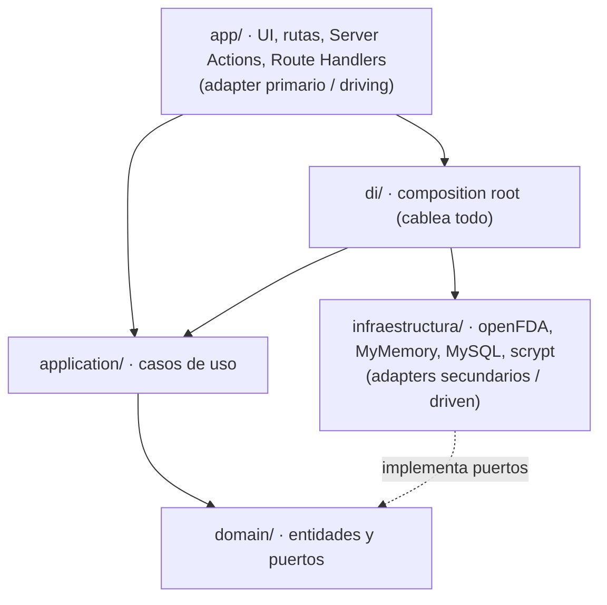

# 💊 FarmaceuticoLearn


**Plataforma de estudio de medicamentos para estudiantes de farmacia.** El usuario consulta y repasa fichas de fármacos (principio activo, indicaciones, dosis, contraindicaciones, efectos adversos) construidas a partir de APIs externas, y practica con **rondas de repaso tipo test**.

No somos la fuente de la verdad de los datos: los consumimos de fuentes públicas, los traducimos a nuestro propio modelo y los presentamos en un formato pensado para aprender.

---

## 📑 Índice

- [Avances (qué está construido)](#-avances-qué-está-construido)
- [Stack y entorno](#️-stack-y-entorno)
- [Arquitectura](#-arquitectura-hexagonal--ddd)
- [Fuentes de datos externas](#-fuentes-de-datos-externas)
- [Claves de uso — correr en local](#-claves-de-uso--correr-en-local)
- [Variables de entorno](#-variables-de-entorno)
- [Scripts disponibles](#-scripts-disponibles)
- [API de usuarios (REST)](#-api-de-usuarios-rest)
- [Proceso de desarrollo](#-proceso-de-desarrollo)

---

## 🚀 Avances (qué está construido)

| Módulo | Estado | Descripción |
|---|---|---|
| **Catálogo y fichas** | ✅ | Enciclopedia de medicamentos con buscador y filtro por categoría terapéutica. Ficha por fármaco con sus secciones de prospecto. |
| **Traducción** | ✅ | El contenido de openFDA llega en inglés; se traduce al español bajo demanda (adapter MyMemory) y se cachea en la base. |
| **Imágenes moleculares** | ✅ | Cada card muestra la estructura molecular del principio activo (PubChem, dominio público), no una foto del producto (copyright). |
| **Juego de repaso** | ✅ | Rondas tipo test **en español**: se nombra un fármaco y se pregunta por su **grupo terapéutico** o su **principio activo**, con 4 opciones, timer, progreso y puntuación. |
| **Ranking** | ✅ | Leaderboard semanal calculado a partir de las rondas jugadas. |
| **Usuarios (registro + login)** | ✅ | Alta de cuenta e inicio de sesión con contraseñas hasheadas (scrypt). *Sesión persistente: pendiente (ver `TODO(auth)`).* |

> **Sobre el juego:** las preguntas se montan solo sobre datos estructurados y en español (grupo terapéutico derivado del principio activo, y el propio principio activo). No se muestran fragmentos crudos del prospecto, porque openFDA solo los da como prosa libre en inglés.

---

## 🛠️ Stack y entorno

| Pieza | Versión | Rol |
|---|---|---|
| **Lenguaje** | TypeScript 5 | Todo el código, front y back. |
| **Framework** | Next.js 16.2 (App Router) | UI, rutas, Server Actions y Route Handlers. |
| **UI** | React 19.2 | Componentes de servidor y de cliente. |
| **Estilos** | Tailwind CSS 4 | Diseño (tokens de color propios en `globals.css`). |
| **Base de datos** | MySQL 8+ / MariaDB (driver `mysql2`) | Caché de fichas, traducciones, usuarios y rondas. |
| **Runtime / tooling** | Node.js 20.6+ (probado en 24), `tsx`, ESLint 9 | Ejecutar scripts `.mts`/`.mjs` y lint. |

> ⚠️ Esta versión de Next.js trae *breaking changes* respecto a lo que "se sabe" de Next. Antes de escribir código, consulta la guía correspondiente en `node_modules/next/dist/docs/`. Ver [`AGENTS.md`](./AGENTS.md).

---

## 🧱 Arquitectura: hexagonal + DDD

La decisión de fondo del proyecto: **el dominio no sabe que existe Next.js, ni HTTP, ni openFDA, ni MyMemory, ni MySQL.** Todo lo de fuera entra y sale por **puertos** (interfaces que define el dominio) implementados con **adapters** en infraestructura.

El motivo práctico: si mañana cambiamos openFDA por CIMA/AEMPS, MyMemory por DeepL, o el hashing de scrypt por bcrypt, se escribe un adapter nuevo y **no se toca ni una línea** del dominio ni de la aplicación.

### La regla de dependencia

Las dependencias apuntan **siempre hacia adentro**, nunca al revés.



- `domain/` no importa de nadie.
- `application/` solo importa de `domain/`.
- `infraestructura/` implementa los puertos de `domain/`.
- `app/` invoca casos de uso ya cableados en `di/`; **nunca** llama a un servicio externo directamente.

### Estructura (bounded contexts)

```
src/
├── medicamentos/     # contexto: catálogo, fichas y traducción
│   ├── domain/            Medicamento, Ficha, Traductor (puerto), CatalogoExterno (puerto)…
│   ├── application/       BuscarMedicamentos, ObtenerFichaMedicamento, SincronizarMedicamentos
│   └── infraestructura/   OpenFdaCatalogo, MyMemoryTraductor, GoogleTraductor,
│                          MysqlMedicamentoRepository, MysqlTraduccionRepository
│
├── juego/            # contexto: rondas de repaso tipo test
│   ├── domain/            MedicamentoJugable, Ronda, Pregunta, GeneradorDePreguntas, Ranking…
│   ├── application/       CrearRonda, ObtenerRonda, ResponderPregunta, ObtenerRanking
│   └── infraestructura/   MysqlCatalogoJugable, MysqlRondaRepository, MysqlRanking
│
├── usuarios/         # contexto: registro, login y CRUD
│   ├── domain/            Usuario, Hasher (puerto), UsuarioRepository (puerto), errors
│   ├── application/       CrearUsuario, IniciarSesion, …
│   └── infraestructura/   MysqlUsuarioRepository, ScryptHasher
│
├── shared/           # utilidades transversales (pool de MySQL, contenido)
├── di/               # composition root: aquí se cablea todo (container.ts)
└── app/              # App Router (adapter primario)
    ├── medicamentos/     enciclopedia y ficha por id
    ├── juego/            crear ronda y jugarla
    ├── ranking/          leaderboard
    ├── usuarios/         crear cuenta / iniciar sesión
    └── api/usuarios/     Route Handlers REST
```

---

## 🌐 Fuentes de datos externas

| Servicio | Rol | ¿Necesita credencial? |
|---|---|---|
| [openFDA](https://open.fda.gov/apis/) | Fuente de las fichas (drug label). Devuelve todo **en inglés**. | API key **opcional** (sube el rate limit). |
| [MyMemory](https://mymemory.translated.net/doc/spec.php) | Traduce el contenido de la ficha al español. **Adapter en uso.** | **No.** Solo un email opcional para ampliar cuota. |
| [PubChem](https://pubchem.ncbi.nlm.nih.gov/) | Estructuras moleculares de los principios activos (dominio público). | No. |
| [Google Cloud Translation](https://cloud.google.com/translate/docs) | Traductor alternativo (adapter escrito, no cableado). | API key (si se decide usar). |

---

## 🔑 Claves de uso — correr en local

### Requisitos previos

- **Node.js 20.6+** (probado en 24) y **npm**.
- **MySQL 8+** o **MariaDB** en marcha (por ejemplo, vía XAMPP).

### Paso a paso

```bash
# 1. Clonar e instalar dependencias
git clone <url-del-repo>
cd page_medicamento
npm install

# 2. Crear la base de datos y las tablas (crea la base `farmaciaLear`)
mysql -u root -p < schema.sql

# 3. Configurar las variables de entorno
cp .env.example .env.local
#    edita .env.local con tus credenciales de MySQL (ver tabla más abajo)

# 4. Comprobar que la conexión y el esquema están bien
node --env-file=.env.local scripts/check-db.mjs

# 5. Poblar el catálogo desde openFDA (selección variada de fármacos comunes)
node --conditions=react-server --import tsx --env-file=.env.local scripts/seed-catalogo.mts

# 6. (Opcional) Descargar las estructuras moleculares a public/estructuras/
node --env-file=.env.local scripts/descargar-estructuras.mjs

# 7. Arrancar en desarrollo
npm run dev        # → http://localhost:3000
```

> **La única credencial *obligatoria* es la de MySQL.** openFDA y MyMemory funcionan sin clave (la API key / el email solo amplían la cuota diaria), y Google solo hace falta si cambias el traductor en `src/di/container.ts`.

Para traer un fármaco concreto (o más) en cualquier momento:

```bash
npm run sync -- ibuprofen          # un término
npm run sync -- "amoxicillin" 50   # término + límite de resultados
```

---

## ⚙️ Variables de entorno

> Los secretos **NO** se commitean: `.env*` está en `.gitignore`. Copia `.env.example` a `.env.local` y rellena ahí tus valores reales.

| Variable | Obligatoria | Para qué / dónde conseguirla |
|---|---|---|
| `MYSQL_HOST` | sí | Host de MySQL/MariaDB. En local, `localhost`. |
| `MYSQL_PORT` | no (def. 3306) | Puerto de la base. |
| `MYSQL_USER` | sí | Usuario de la base. En XAMPP suele ser `root`. |
| `MYSQL_PASSWORD` | no* | Contraseña. *Puede ir vacía (root local sin password). |
| `MYSQL_DATABASE` | sí | Nombre de la base. El `schema.sql` crea `farmaciaLear`. |
| `MYSQL_CONNECTION_LIMIT` | no (def. 10) | Conexiones simultáneas del pool. |
| `OPENFDA_API_KEY` | no | Sin key: 240 req/min por IP. Con key: 1.000. Gratis en [open.fda.gov](https://open.fda.gov/apis/authentication/). |
| `MYMEMORY_EMAIL` | no | Un email válido sube la cuota de MyMemory de 5.000 a 50.000 chars/día. **No es una API key.** |
| `GOOGLE_TRANSLATE_API_KEY` | no | Solo si cambias el traductor a Google en `src/di/container.ts`. |

---

## 📜 Scripts disponibles

| Comando | Qué hace |
|---|---|
| `npm run dev` | Servidor de desarrollo en `http://localhost:3000`. |
| `npm run build` | Compilación de producción. |
| `npm run start` | Sirve la build de producción. |
| `npm run lint` | ESLint. |
| `npm run sync -- <término> [límite]` | Sincroniza un fármaco desde openFDA a la base. |
| `node … scripts/seed-catalogo.mts` | Puebla un catálogo variado (todas las categorías del filtro). |
| `node --env-file=.env.local scripts/descargar-estructuras.mjs` | Descarga las estructuras moleculares (PubChem) a `public/estructuras/`. |
| `node --env-file=.env.local scripts/check-db.mjs` | Verifica conexión y esquema de MySQL. |

---

## 🔐 API de usuarios (REST)

Rutas en `src/app/api/usuarios/`. De cara al usuario final: **registro** e **inicio de sesión**. El `password_hash` **nunca** sale en las respuestas.

| Método | Ruta | Body | Respuestas |
|---|---|---|---|
| `POST` | `/api/usuarios` | `{ nombre, correo, password }` | `201` · `400` · `409` (correo repetido) |
| `POST` | `/api/usuarios/login` | `{ correo, password }` | `200` · `401` (credenciales inválidas) |

Las contraseñas se guardan hasheadas con **scrypt** (`node:crypto`, sin dependencias nuevas), en formato `salt:hash`. Cambiar a bcrypt/argon2 es escribir otro adapter del puerto `Hasher` y cambiar una línea en `di/container.ts`.

```bash
# Registro
curl -X POST http://localhost:3000/api/usuarios \
  -H "Content-Type: application/json" \
  -d '{"nombre":"Ana","correo":"ana@ejemplo.com","password":"secreto123"}'

# Login
curl -X POST http://localhost:3000/api/usuarios/login \
  -H "Content-Type: application/json" \
  -d '{"correo":"ana@ejemplo.com","password":"secreto123"}'
```

> **NOTA(auth):** el login verifica las credenciales pero todavía **no abre sesión** (no hay cookie ni token). Establecer la sesión es el siguiente paso; ver el `TODO(auth)` en `src/di/container.ts`.

---

## 🔄 Proceso de desarrollo

1. **Ingesta:** un caso de uso (`SincronizarMedicamentos`) pide fichas a openFDA (adapter `OpenFdaCatalogo`) y las guarda en MySQL. Es una caché local: no se llama a la API en cada carga de página.
2. **Traducción diferida:** al abrir una ficha, el texto en inglés se traduce al español (adapter `MyMemoryTraductor`) y se **cachea** en `medicamento_traduccion`. Solo se traduce una vez por campo.
3. **Presentación:** las páginas del App Router (`app/`) invocan casos de uso ya cableados en `di/container.ts` y muestran el modelo propio, nunca la respuesta cruda de la API.
4. **Repaso:** el juego lee del catálogo, genera preguntas tipadas (`GeneradorDePreguntas`) sobre datos estructurados y persiste la ronda; al terminar calcula puntos y alimenta el ranking.

> El código y los comentarios están en **español**; los términos técnicos se mantienen en inglés.
